# 🚀 Seq2Seq Fine-Tuning Pipeline (Multilingual Ready, Scalable & Efficient)

This repository contains an **end-to-end fine-tuning pipeline** for Seq2Seq models (e.g., T5, mBART) with a focus on:
- ✅ **Scalability** (Data Lakehouse architecture)
- 🌍 **Multilingual support** (currently tested on a single language)
- ⚡ **Efficiency** (GPU/CPU compatible training)
- 📦 **Reproducibility** (via Docker + MLflow)

---

## 📌 Architecture Overview

**Architecture Diagram**: 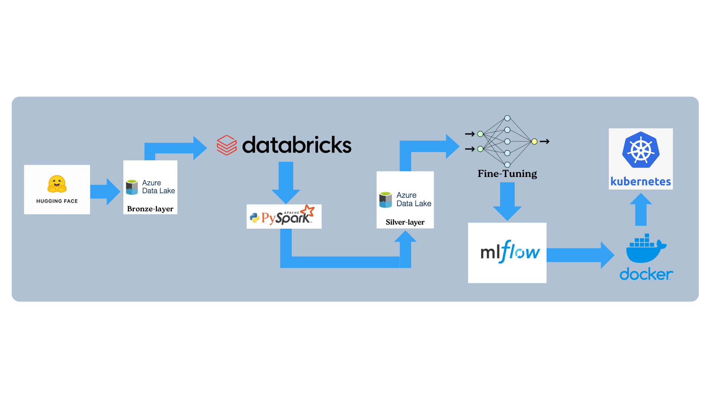

---

## 📊 Project Workflow

### 🏁 Step 1: Data Ingestion from Hugging Face

We use the **Culturax dataset** from Hugging Face's Datasets Hub. This dataset is accessed via the Hugging Face `datasets` library.

- The dataset is pulled via an API call using Python.
- It can be configured to load a specific language subset.
- This raw data is stored in **Azure Blob Storage** (Bronze layer) for raw preservation.

### 🔗 Why this step?
Storing raw data in a cloud-native, scalable object store allows for reusability, traceability, and versioning — all essential for robust MLOps.

**Data Ingestion**: 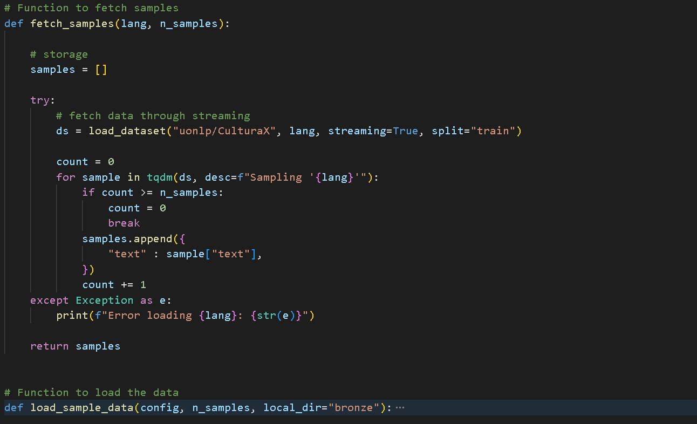

**Bronze Container**: 

---

## 🔧 Step 2: Data Transformation with Spark (Databricks)

Once the raw data is stored in Azure, we mount the Blob Storage in **Databricks** and use **PySpark** to clean and transform it.

- Text is tokenized using model's tokenizer.
- Transformed data is saved to the **Silver layer** of Azure Blob.

**Spark Session**: 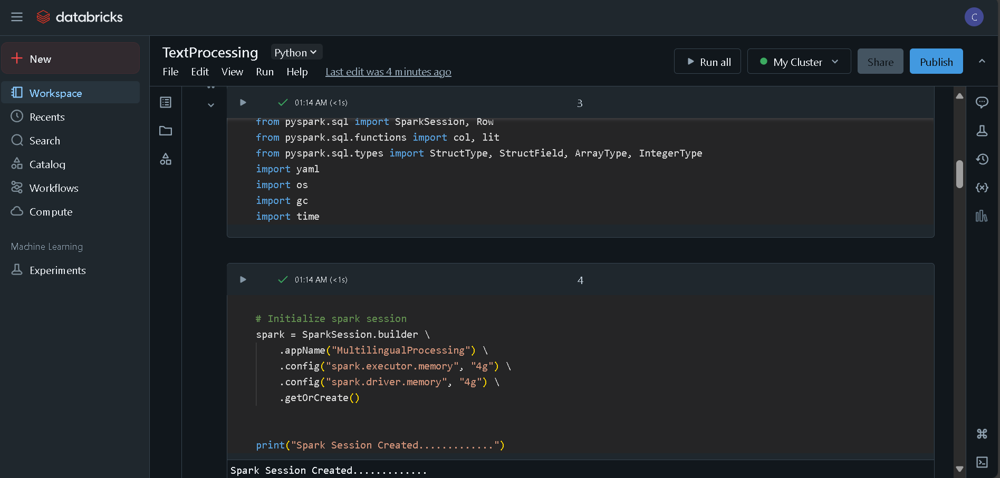

**Data Transformation**: 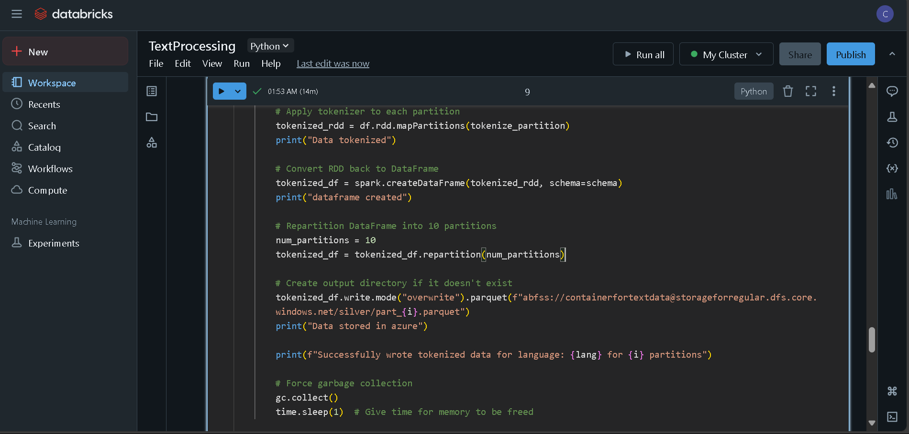

**Silver Container**: 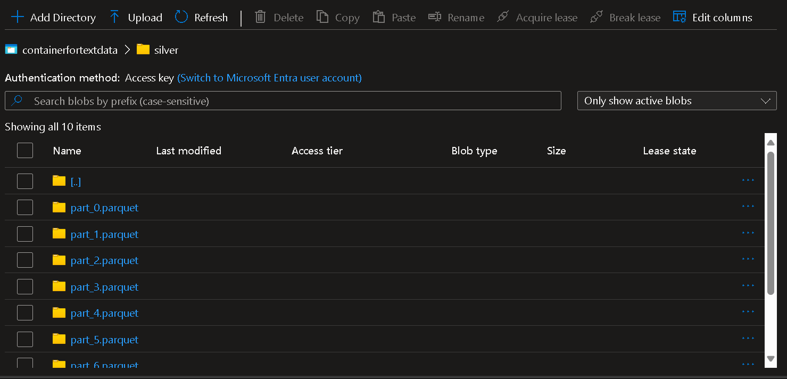

### 🔗 Why this step?
Using Spark on Databricks gives the ability to process large datasets at scale. Saving clean data in a silver layer ensures consistent downstream consumption for model training.

---

## 🧠 Step 3: Model Training (CPU/GPU Compatible)

The transformed data is downloaded from the `silver` container and loaded into a training script (supports both CPU and GPU environments).

- Hugging Face `Trainer` API is used to fine-tune models like mT5 or mBART.
- Training can be ported to any environment.
- Uses `Datasets`, `Transformers`, and optionally `Accelerate` for efficient training.

**Training Logs**: 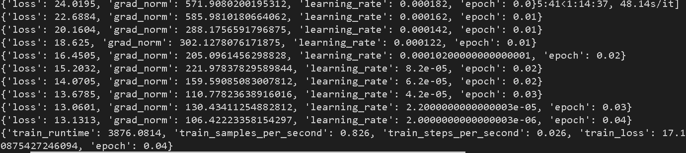

**Containerization using Docker**: 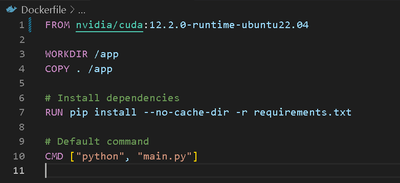

### 🔗 Why this step?
Training in a container ensures reproducibility and compatibility with any cloud/edge device in future deployments.

---

## 📈 Step 4: Experiment Tracking with MLflow

Training runs are logged using **MLflow**:
- Parameters (e.g., learning rate)
- Metrics (e.g., loss)
- Artifacts (trained models, tokenizer, configs)

This gives you a centralized dashboard to compare different runs and manage model versions.

**MLflow Experiments**: 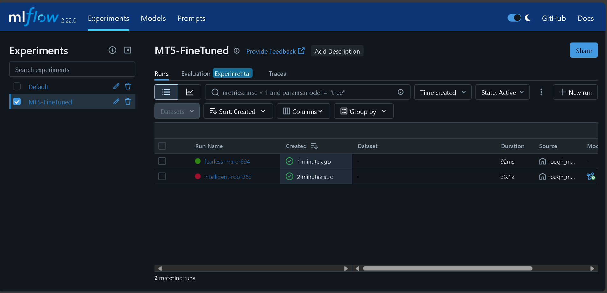

**MLflow Metrics**: 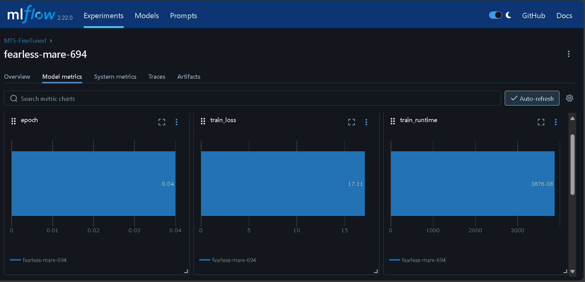

**MLflow Models**: 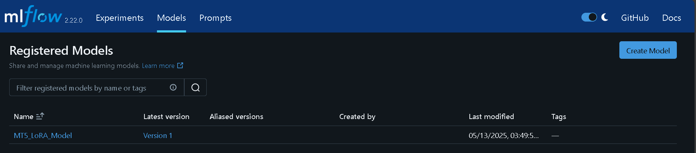

**MLflow Model Versions**: 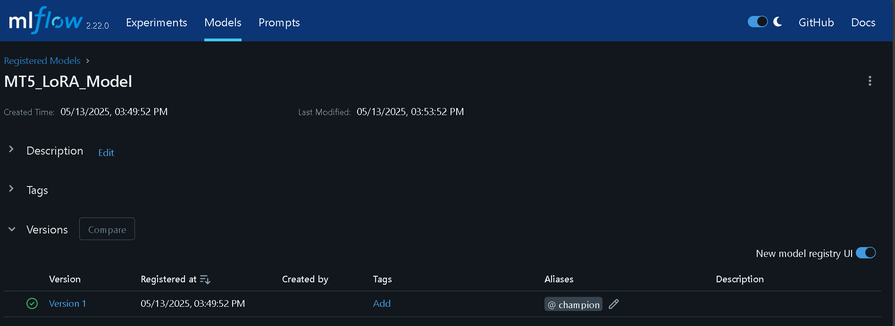

### 🔗 Why this step?
MLflow ensures traceability and experiment reproducibility. It also allows easier deployment integration later on (e.g., serving models via MLflow REST APIs).

---

## 📦 Step 5: Containerization with Docker

The entire workflow — from data fetch to model training and logging — is encapsulated in a **Docker container**.

- Dockerfile defines dependencies (Python, PyTorch, Hugging Face, Spark, MLflow).
- Environment is portable and reproducible across local, cloud, and CI/CD setups.

**Docker Script**: 

**Docker Container**: 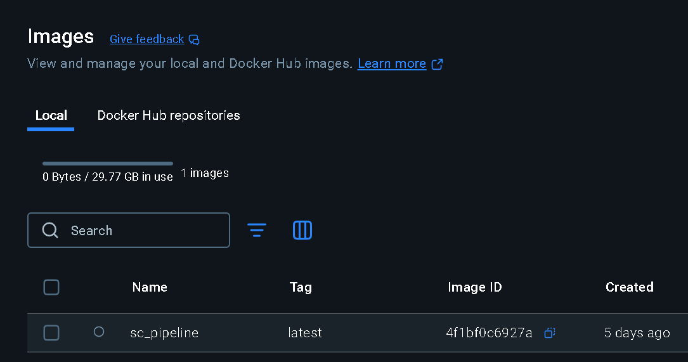

### 🔗 Why this step?
Containerization eliminates "it works on my machine" problems, and allows seamless scaling to cloud VMs or Kubernetes clusters.

---

## 🙌 Summary

This pipeline is built for:
- ✅ Scalable data workflows (Azure + Spark)
- ⚙️ Modular and reproducible training (Docker + Hugging Face)
- 📊 Transparent experiment tracking (MLflow)
- 🌍 Future-ready for multilingual and production-grade deployment

---
